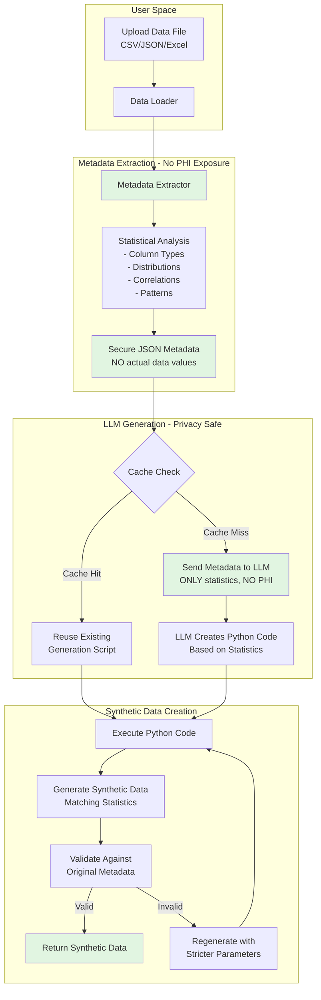

# BYOD Synthetic Data Generator - Architecture Flow

## How It Works

## Privacy Protection

**THE LLM NEVER SEES YOUR ACTUAL DATA**

1. **Metadata Extraction**: Analyzes your data locally to extract only statistical properties:
   - Column names and data types
   - Statistical distributions (mean, std, min, max)
   - Correlation patterns between columns
   - Value patterns (e.g., date formats, string patterns)
   - NO actual data values are extracted

2. **LLM Role**: The LLM receives only the metadata and creates Python code to generate synthetic data that matches the statistical properties. It never sees any actual data values.

3. **Synthetic Generation**: The Python code runs locally to create new synthetic data matching the patterns.

## Column Type Detection

The system detects column types through:
- Pandas dtype inference
- Pattern matching (dates, emails, phones)
- Statistical analysis (numeric distributions)
- Value frequency analysis (categorical detection)

## Caching Mechanism

When you upload a file:
1. A hash is created from the metadata structure
2. Similar metadata patterns are searched in the cache
3. If found (based on match threshold), existing generation code is reused
4. This ensures consistent results for similar data structures

## Known Limitations

- **Date Detection**: Currently relies on pandas inference which may miss custom date formats
- **Semantic Understanding**: The system doesn't understand domain context (e.g., "medication" columns)
- **Complex Relationships**: Multi-column dependencies may not be fully preserved

## Future Improvements

- Domain-specific value lists (medications, diagnoses, etc.)
- Better date/time format detection
- Semantic column understanding
- Multi-column relationship preservation